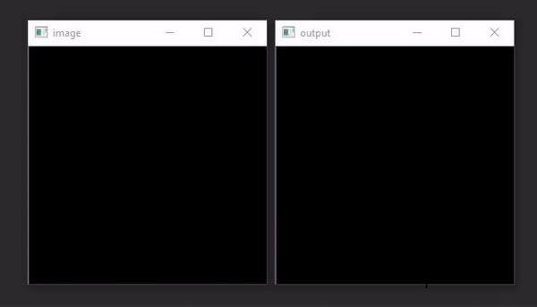

# Shallow network to recognize MNIST database

Built a fully connected neural network with numpy from scratch. Implementation of stochastic gradient descent with L2 regularization. Best results were obtained with a single hidden layer of 100 neurons. Trained 9 models which then vote on what number has been drawn. The accuracy in the MNIST database is 98% but more like 80% with my handwriting.

To challenge the model by drawing digits, run `guessingDigits.py`. To train the model, run `trainingNet.py`.

Based mostly on the content of [this](http://neuralnetworksanddeeplearning.com/) online book.
